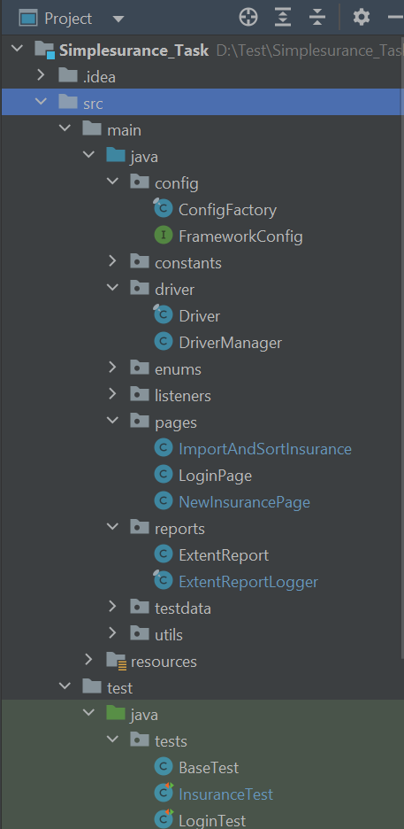
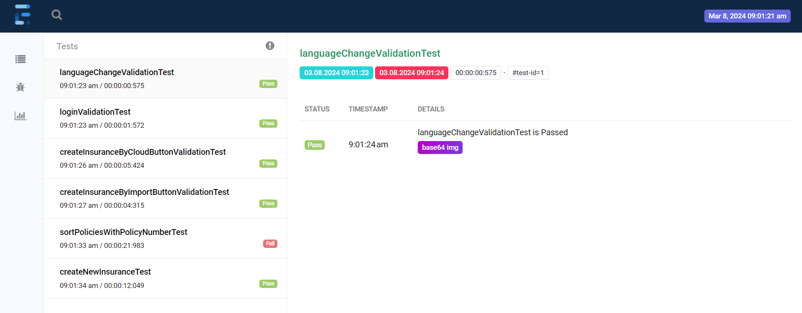
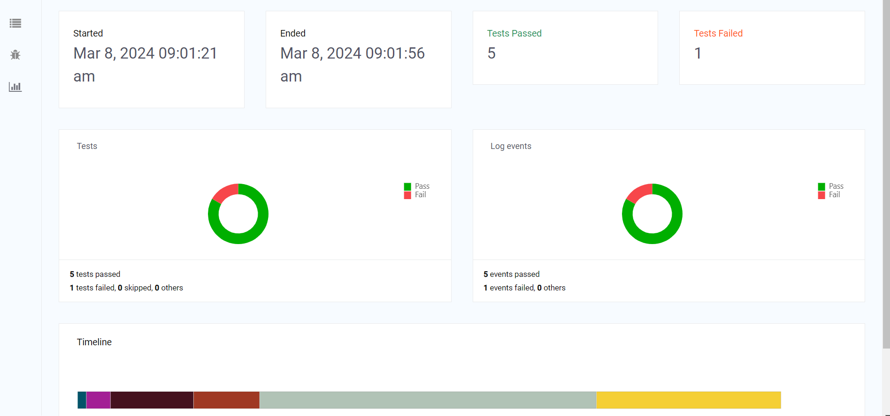

**Getting Started:**
1. git clone https://github.com/Nayanacs19/Simplesurance_Task.git
2. Navigate to Simplesurance_Task Project

**Supported versions:**
1. Used WedriverManager which supports below versions
    Chrome version 114 or below
    Mozilla firefox 120 or below
2. mvn version 3.2.5
3. Selenium 4.0

Project Structure

**Running Test**
1. Open terminal from root project folder and run mvn test OR
2. Open project in code editor like eclipse or intellij idea ==> right click on testng.xml ==> run as testng.xml

**Report Path**
<ROOT_PROJECT>/report.html

**Test Summary Report:**

